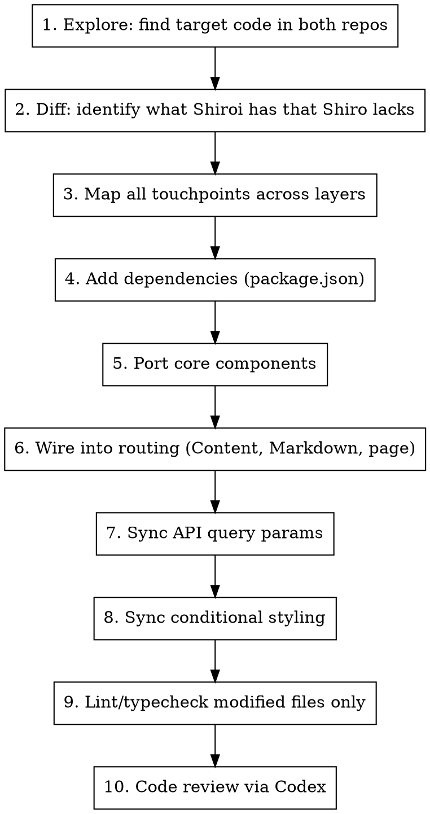

# Sync Upstream Feature

## Overview

Port features stripped during Shiroi-to-Shiro sync back into the open-source repo. The closed-source Shiroi repo lives at `/Users/innei/git/innei-repo/Shiroi`, the open-source Shiro at `/Users/innei/git/innei-repo/Shiro`.

## Repo Layout

| Repo | Path | Role |
|------|------|------|
| Shiro | `/Users/innei/git/innei-repo/Shiro` | Open-source, primary working dir |
| Shiroi | `/Users/innei/git/innei-repo/Shiroi` | Closed-source upstream, read-only reference |

Both share the same monorepo structure (`apps/web/src/...`). Shiroi is the superset.

## Workflow



### 1. Explore Both Repos

Use parallel Explore agents to search the target feature keyword in both repos. Identify:
- Which files exist in Shiroi but not Shiro
- Which files exist in both but differ
- Which dependencies Shiroi has that Shiro lacks

### 2. Diff: Identify the Gap

Compare key files side-by-side. Focus on:
- **Component files**: Shiroi may have extra renderers, wrappers, or providers
- **Routing files** (`*Content.tsx`): Shiroi branches on a discriminator (e.g. `contentFormat`), Shiro always takes one path
- **Lazy-load entries** (`*Markdown.tsx`): Used in preview/peek contexts, often overlooked
- **API query definitions** (`queries/definition/*.ts`): Shiroi may pass extra params (e.g. `prefer: 'lexical'`)
- **Server-side API files** (`api.ts`): Direct `apiClient` calls may also need params

### 3. Map All Touchpoints

A feature typically spans these layers (check ALL):

| Layer | Files | What to sync |
|-------|-------|--------------|
| Dependencies | `package.json`, `pnpm-lock.yaml` | New npm packages |
| Core components | `components/ui/...` | Rendering logic |
| Route renderers | `*LexicalRenderer.tsx`, etc. | Per-route wrappers |
| Content branching | `*Content.tsx` | `contentFormat` discriminator |
| Lazy-load entries | `*Markdown.tsx` | Dynamic import + branching for preview/peek |
| API queries | `queries/definition/*.ts` | Query params like `prefer` |
| Server API | `app/[locale]/.../api.ts` | Direct apiClient calls |
| Conditional styles | `page.tsx`, `layout.tsx` | `prose` class gating |
| TOC / headings | `TocHeadingStrategy.tsx` | Already wired, verify |

### 4. Add Dependencies

Read Shiroi's `package.json`, extract only the packages needed for **rendering** (not editing/dashboard). Add to Shiro's `package.json` alphabetically, then `pnpm install`.

### 5. Port Core Components

Copy from Shiroi, adapting for Shiro:
- Remove Shiroi-exclusive wrappers (e.g. `LexicalCommentWrapper` is sponsorship-only)
- Check that all `~/` imports resolve in Shiro (modal types, hooks, constants)
- Fix any API mismatches (e.g. `contentClassName` prop may not exist in Shiro's modal types)

### 6. Wire Into Routing

Three integration points per content type (note/post/page):

**`*Content.tsx`** (server component entry):
```tsx
if (contentFormat === 'lexical') return <XxxLexicalRenderer />
return <XxxMarkdownRenderer />
```

**`*Markdown.tsx`** (lazy-load entry for preview/peek):
```tsx
const XxxLexicalRenderer = dynamic(() => import('./XxxLexicalRenderer').then(m => m.XxxLexicalRenderer))
// ... branch on contentFormat from data selector
```

**`page.tsx` / `layout.tsx`** (conditional prose):
```tsx
className={clsx(data.contentFormat !== 'lexical' && 'prose')}
```

### 7. Sync API Query Params

Compare `queries/definition/*.ts` and `app/.../api.ts` between repos. Add missing params (e.g. `prefer: 'lexical'`).

### 8. Lint and Verify

- Lint **only modified files**: `pnpm exec eslint --fix <files>`
- Typecheck: `pnpm exec tsc --noEmit` — ignore pre-existing errors, verify new files don't appear in output

## Common Mistakes

| Mistake | Fix |
|---------|-----|
| Only update `*Content.tsx`, forget `*Markdown.tsx` | Markdown.tsx is the lazy entry for preview/peek — always update both |
| Forget API `prefer` param | Backend won't return rich content without it |
| Copy Shiroi-only wrappers verbatim | Strip sponsorship features (comment anchoring, AI, etc.) |
| Leave `prose` class unconditional | Rich content has its own typography — gate with `contentFormat` |
| Add editing dependencies when only rendering needed | Only port what's required for the read path |
