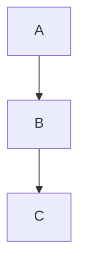

# Markdown 格式完整示例文档

本文档展示了本项目支持的所有 Markdown 格式及其使用示例。

## 目录

- [基础格式](#基础格式)
  - [标题](#标题)
  - [文本格式](#文本格式)
  - [水平线](#水平线)
  - [引用](#引用)
  - [列表](#列表)
  - [代码](#代码)
  - [链接和图片](#链接和图片)
  - [表格](#表格)
- [自定义语法](#自定义语法)
  - [数学公式](#数学公式)
  - [社交媒体提及](#社交媒体提及)
  - [剧透文本](#剧透文本)
  - [标签页](#标签页)
  - [自定义容器](#自定义容器)
  - [可折叠内容](#可折叠内容)
  - [视频嵌入](#视频嵌入)
  - [脚注](#脚注)
  - [上标和下标](#上标和下标)
  - [定义列表](#定义列表)
  - [缩写](#缩写)
  - [自定义标签](#自定义标签)

---

## 基础格式

### 标题

```markdown
# 一级标题
## 二级标题
### 三级标题
#### 四级标题
##### 五级标题
###### 六级标题
```

**渲染效果：**

# 一级标题
## 二级标题
### 三级标题
#### 四级标题
##### 五级标题
###### 六级标题

---

### 文本格式

```markdown
**粗体文本**
*斜体文本*
~~删除线文本==

++插入文本++
==高亮文本==
```

**渲染效果：**

**粗体文本**
*斜体文本*
~~删除线文本==

++插入文本++
==高亮文本==

---

### 水平线

```markdown
---
```

**渲染效果：**

---

---

### 引用

```markdown
> 普通引用

> [!NOTE] 注意提示
> [!TIP] 提示信息
> [!WARNING] 警告
> [!CAUTION] 谨慎
> [!IMPORTANT] 重要

> 嵌套引用
> > 第二层
```

**渲染效果：**

> 普通引用

> [!NOTE] 注意提示
> [!TIP] 提示信息
> [!WARNING] 警告
> [!CAUTION] 谨慎
> [!IMPORTANT] 重要

> 嵌套引用
> > 第二层

---

### 列表

```markdown
- 无序列表项 1
- 无序列表项 2
  - 嵌套项

1. 有序列表项 1
2. 有序列表项 2

- [ ] 未完成任务
- [x] 已完成任务
```

**渲染效果：**

- 无序列表项 1
- 无序列表项 2
  - 嵌套项

1. 有序列表项 1
2. 有序列表项 2

- [ ] 未完成任务
- [x] 已完成任务

---

### 代码

```markdown
行内代码 `const a = 1`

代码块
```javascript
const a = 1
console.log(a)
```

带文件名和折叠
```javascript filename="example.js" collapsed
const a = 1
```

Mermaid 图表


Excalidraw 绘图
```excalidraw
JSON data
```

React 组件渲染
```component shadow with-styles
import=https://cdn.jsdelivr.net/npm/...
```
```

**渲染效果：**

行内代码 `const a = 1`

代码块

```javascript
const a = 1
console.log(a)
```

带文件名和折叠

```javascript filename="example.js" collapsed
const a = 1
```

Mermaid 图表


Excalidraw 绘图

```excalidraw
{
  "type": "excalidraw",
  "version": 2,
  "source": "https://excalidraw.com"
}
```

---

### 链接和图片

```markdown
[链接文本](https://example.com)

[带标题的链接](https://example.com "标题")


!图片描述 (图片自动缩放)
!!图片描述 (禁止缩放)

图片引用式
![Alt text][id]
[id]: https://example.com/image.jpg
```

**渲染效果：**

[链接文本](https://example.com)

[带标题的链接](https://example.com "标题")


**图片引用式：**


---

### 表格

```markdown
| 表头1 | 表头2 | 表头3 |
|-------|-------|-------|
| 内容1 | 内容2 | 内容3 |
| 内容4 | 内容5 | 内容6 |
```

**渲染效果：**

| 表头1 | 表头2 | 表头3 |
|-------|-------|-------|
| 内容1 | 内容2 | 内容3 |
| 内容4 | 内容5 | 内容6 |

---

## 自定义语法

### 数学公式

使用 KaTeX 渲染数学公式。

```markdown
行内公式 $E = mc^2$

块级公式
$$
\frac{-b \pm \sqrt{b^2 - 4ac}}{2a}
$$
```

**渲染效果：**

行内公式 $E = mc^2$

块级公式

$$
\frac{-b \pm \sqrt{b^2 - 4ac}}{2a}
$$

---

### 社交媒体提及

支持提及 GitHub、Twitter/X、Telegram 用户。

```markdown
{GH@Innei}
{TW@Innei}
{TG@Innei}

[显示名]{GH@Innei}
```

**渲染效果：**

{GH@Innei}
{TW@Innei}
{TG@Innei}

[显示名]{GH@Innei}

---

### 剧透文本

使用双竖线包裹内容，创建可点击的剧透隐藏文本。

```markdown
||这是隐藏内容||
```

**渲染效果：**

||这是隐藏内容||

---

### 标签页

使用自定义 HTML 组件创建标签页。

```markdown
<Tabs>
  <tab label="Tab 1">
    内容 1
  </tab>
  <tab label="Tab 2">
    内容 2
  </tab>
</Tabs>
```

**渲染效果：**

<Tabs>
  <tab label="Tab 1">
    内容 1
  </tab>
  <tab label="Tab 2">
    内容 2
  </tab>
</Tabs>

---

### 自定义容器

使用 `:::` 语法定义自定义容器。

#### 图片画廊

```markdown
::: gallery


:::

::: carousel


:::
```

---

#### 警告框

```markdown
::: info
信息内容
:::

::: success
成功内容
:::

::: warning
警告内容
:::

::: error
错误内容
:::

::: note
注意内容
:::

::: banner{warn}
带类型参数的横幅
:::
```

**渲染效果：**

::: info
这是一个信息提示框
:::

::: success
这是一个成功提示框
:::

::: warning
这是一个警告提示框
:::

::: error
这是一个错误提示框
:::

::: note
这是一个注意提示框
:::

---

#### 网格布局

```markdown
::: grid {cols=2,gap=8,rows=2,type=normal}


:::

::: grid {cols=2,gap=8,type=images}


:::
```

**渲染效果：**

::: grid {cols=2,gap=8,type=images}


:::

---

#### 瀑布流布局

```markdown
::: masonry {gap=8}


:::
```

**渲染效果：**

::: masonry {gap=8}


:::

---

### 可折叠内容

使用标准的 HTML `<details>` 和 `<summary>` 标签。

```markdown
<details>
<summary>点击展开</summary>
这里是可折叠的内容区域
</details>
```

**渲染效果：**

<details>
<summary>点击展开</summary>
这里是可折叠的内容区域
</details>

---

### 视频嵌入

支持两种方式嵌入视频：

```markdown
使用 HTML video 标签：
<video src="https://example.com/video.mp4"></video>

使用图片语法（自动检测视频扩展名）：

```

---

### 脚注

```markdown
这是脚注引用[^1]。
这是另一个脚注引用[^2]。

重复引用[^2]。

[^1]: 第一个脚注的内容，可以包含**格式化文本**
[^2]: 第二个脚注的内容
```

**渲染效果：**

这是脚注引用[^1]。
这是另一个脚注引用[^2]。

重复引用[^2]。

[^1]: 第一个脚注的内容，可以包含**格式化文本**
[^2]: 第二个脚注的内容

---

### 上标和下标

```markdown
19^th^
H~2~O
```

**渲染效果：**

19^th^
H~2~O

---

### 定义列表

```markdown
术语 1
: 定义 1

术语 2
: 定义 2
```

**渲染效果：**

术语 1
: 定义 1

术语 2
: 定义 2

---

### 缩写

```markdown
*[HTML]: Hyper Text Markup Language

这是 HTML 缩写
```

**渲染效果：**

*[HTML]: Hyper Text Markup Language

这是 HTML 缩写

---

### 自定义标签

```markdown
<tag>标签内容</tag>
```

**渲染效果：**

<tag>标签内容</tag>

---

## 代码块特殊参数

代码块支持以下参数：

- `filename="文件名"` - 显示文件名
- `collapsed` - 默认折叠代码块
- `expand` - 默认展开代码块

示例：

```javascript filename="utils.js" collapsed
function hello() {
  console.log('Hello, World!');
}
```

---

## 容器参数说明

### grid 容器参数

- `cols` - 列数，如 `cols=2`
- `rows` - 行数，如 `rows=2`
- `gap` - 间距（像素），如 `gap=8`
- `type` - 类型，`normal`（默认）或 `images`

### masonry 容器参数

- `gap` - 间距（像素），如 `gap=8`

### banner 容器参数

- 支持 `warn`、`error`、`info`、`success`、`warning` 等类型

---

## 注意事项

1. 数学公式使用 `$` 表示行内，`$$` 表示块级
2. 剧透文本使用双竖线 `||` 包裹
3. 社交媒体提及使用 `{平台@用户名}` 格式
4. 自定义容器使用 `:::开始 ... :::` 结束
5. 图片链接前添加 `!` 可自动缩放，添加 `!!` 可禁止缩放
6. 视频扩展名会自动识别并渲染为视频播放器

---

## 技术实现

本项目使用以下技术实现 Markdown 渲染：

- **核心库**: `markdown-to-jsx` (@innei/markdown-to-jsx-yet@7.7.7-11)
- **数学公式**: KaTeX 0.16.28
- **语法高亮**: Prism.js + Shiki
- **图表**: Mermaid
- **绘图**: Excalidraw

---

*最后更新：2026年3月*
